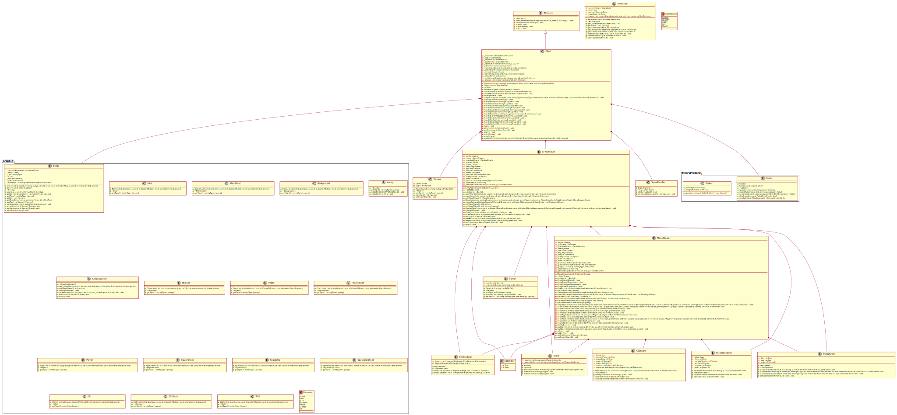
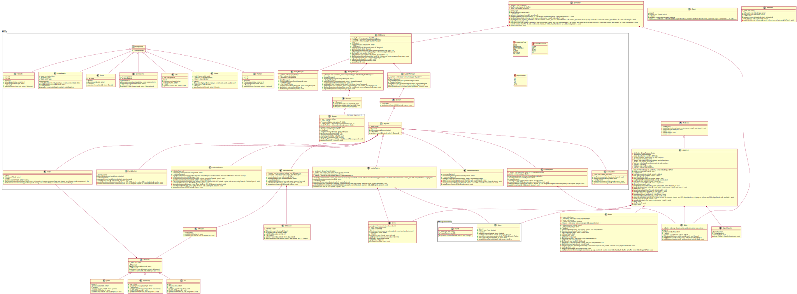

# R-TYPE

## Project
The purpose of this project is to create a one-to-four player game, using a client/server architecture. It has a client/server architecture.
This project uses a multi-thread Boost::asio server and SFML graphical client.

Made by :
- Adrian HOARAU (adrian.hoarau@epitech.eu)
- Arthur BERTAUD (arthur.bertaud@epitech.eu)
- Matthias VIRASSAMY (matthias.virassamy@epitech.eu)
- Benjamin COULON (benjamin.coulon@epitech.eu)

## Umls

## Linux Compilation
To launch the project on a Linux OS you **must** have Conan installed on your machine as well as the conan settings configured for you machine.
Of course the Packages mentionned in the conanfile.txt have to be installed.
 
 ### How to launch the project
 1. Go to the project root and create a `build` directory : `mkdir build`
 2. Then go in that folder : `cd build`
 3. Launch the Conan build command : `conan install .. --build=missing`
 4. Then launch the CMake building command : `cmake .. -G "Unix Makefiles"`
 5. Finally build the project : `cmake --build .`
 6. After that you will find the `r-type-client` and `r-type-server`
## Windows compilation
To launch the project on a Windows 10 OS you **must** have the following tools installed : (_check links in the doc section of the README_)

 - Visual Studio 16 2019 (_version used: **16.8.1**)_
 - Conan Package Manager  (_version used: **1.31.2**)_

Conan will install for you the following packages _(refer to conafile.txt in root)_
 1. Boost _(**1.69**)_
 2. SFML _(**2.5.1**)_
 3. ZLib _(**1.2.11**)_
 4. BZip2 _(**1.0.6**)_

### How to setup before compiling
Before compiling and launching the project you might want to take a look at the CMakeList.txt file :

	25 # WINDOWS USERNAME AND PATH VARIABLE TO BE SET
	26 set(USERS "R-TYPE-USER")
	27 set(SFML_WIN_INCLUDE_DIR "PATH/TO/SFML/INCLUDE")
	28 set(SFML_WIN_DIR "PATH/TO/SFML/FOLDER")
	29 set(CONAN_SFML_DIR "PATH/TO/SFML/CONAN")

Take a look at these paths and adjust them according to your environnement
Then everything should be ready for you to launch this project !

:warning: **If you have problems with SFML install and Conan, you project might not be able to find the libs needed. If so you might want to look into the doc section and look at the Windows SFML install link, after that put the path to the folder in the SFML_WIN_DIR in CMakeList.txt line 27 and the path to the include folder in SFML_WIN_INCLUDE_DIR line 28** :warning:

 
### How to launch the project
 1. First of all you might want to install all packages required by launching the following commad : `conan install .. --build=missing`
 2. After that create a build folder and get into it : `mkdir build && cd build`
 3. Then launch the CMake build : `cmake .. -G "Visual Studio 16 2019"`
 4. Finally, build the solution file with that command : `cmake --build . --config Release`
 5. After that you will find the `r-type-client.exe` and `r-type-server.exe` in the `bin` folder.

## Documentation
 - Conan Windows Install : https://docs.conan.io/en/latest/installation.html 
 - Windows SFML install : https://www.sfml-dev.org/download/sfml/2.5.1/index-fr.php
 - Windows Visual Studio C++ install : https://docs.microsoft.com/fr-fr/cpp/build/vscpp-step-0-installation?view=msvc-160

